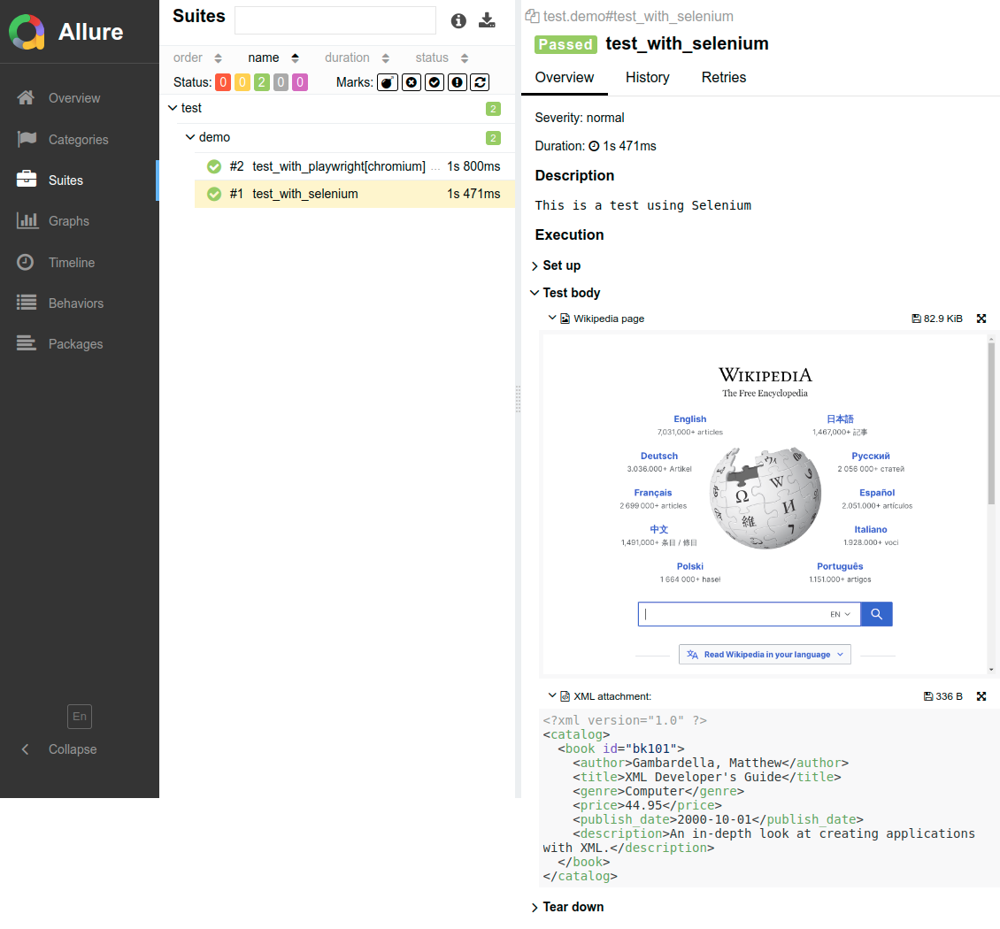

=====
Usage
=====

Options
=======

These are the options that can be added to the ``pytest.ini`` file.

----

* ``extras_screenshots``

The screenshots to add in the report.

Accepted values:

* ``all``:    Include all gathered screenshots in the report.

* ``last``:   Include only the last screenshot of each test in the report. Works only if the API has been previously called during the test execution in order to store the reference of the WebDriver (Selenium) or Page (Playwright) object.

Default value: ``all``

----

* ``extras_sources``

Whether to include gathered webpage sources in the report.

Default value: ``False``

----

* ``extras_description_tag``

The HTML tag for the test description (test docstring).

Accepted values: ``h1``, ``h2``, ``h3``, ``p`` or ``pre``

Default value: ``pre``

----

* ``extras_attachment_indent``

The indentation for attachments

Accepted values: any positive integer.

API
===

The function scoped fixture ``report`` provides the following methods:

To add a step to the report:

.. code-block:: python

  step(
      comment: str = None,
      target: WebDriver|WebElement|Page|Locator = None,
      attachment: Attachment = None,
      full_page: bool = True,
      page_source: bool = False,  # Whether to include the webpage HTML source.
      escape_html: bool = False   # Whether to escape HTML characters in the comment.
  )
  
Auxiliary method to get the code block format of a string:

.. code-block:: python

    attachment(
		text: str = None,            # The content/body of the attachment.
		file: str = None,            # The filepath of the file to attach.
		mime: str = Mime.text_plain  # The attachment mime type.
	) -> Attachment

Limitations
===========

* No support for any kind of parallel tests execution (multi-treads, multi-tabs or multi-windows).

* For Playwright, only ``sync_api`` is supported.

Example
=======

When using the **pytest-html** plugin (with the ``--html`` option), an external CSS file needs be provided with the ``--css`` option.

Command-line invocation
-----------------------

If using pytest-html report:

.. code-block:: bash

  pytest --html=/path/to/report --css=/path/to/css

If using Allure report:

.. code-block:: bash

  pytest --alluredir=/path/to/allure-results

If using both reports:

.. code-block:: bash

  pytest --html=/path/to/report --css=/path/to/css --alluredir=/path/to/allure-results

Sample ``pytest.ini`` file
--------------------------

.. code-block:: ini

  extras_description_tag = h1
  extras_attachment_indent = 4
  extras_screenshots = all
  extras_sources = False

Sample code
-----------

* Example using Selenium

.. code-block:: python

  def test_with_selenium(report):
      """
      This is a test using Selenium
      """
      driver = WebDriver()
      driver.get("https://www.selenium.dev/selenium/web/web-form.html")
      report.step("Get the webpage to test", driver)
      driver.find_element(By.ID, "my-text-id").send_keys("Hello World!")
      report.step("<h1>Set input text</h1>", driver, full_page=True, escape_html=False)
      driver.find_element(By.NAME, "my-password").send_keys("password")
      report.step(comment="Another comment", target=driver)
      report.step("Comment without screenshot")
      report.step(comment="Comment without screenshot")
      driver.quit()

* Example using Playwright

.. code-block:: python

  def test_with_playwright(page: Page, report):
      """
      This is a test using Playwright
      """
      page.goto("https://www.selenium.dev/selenium/web/web-form.html")
      report.step("Get the webpage to test", page)
      report.step(comment="Get the webpage to test", target=page, full_page=False)

* Example adding attachments

.. code-block:: python

  def test_attachments(report):
      """
      This is a test adding XML & JSON attachments
      """
      xml_body = """
          <note>  
              <to>John</to>  
              <from>Diana</from>  
              <heading>Reminder</heading>  
              <body>Don't forget me this weekend!</body>  
          </note>"""
      report(
          "This is a XML document:",
          attachment=report.attachment(
              text=xml_body,
              mime=report.Mime.application_xml
          )
	  )
      report(
          comment="This is a JSON document:",
          attachment=report.attachment(
              file="/path/to/file",
              mime=report.Mime.application_json
          )
	  )

* Example adding links

.. code-block:: python

  def test_links(report):
      """
      This is a test adding links
      """
      report.link("https://en.wikipedia.org")
      report.link("https://wikipedia.org", "Wikipedia")
      report.link(uri="https://wikipedia.org", name="Wikipedia")

Sample CSS file
===============

.. code-block:: css

  .logwrapper {
      max-height: 100px;
  }

  .extras_td {
      width: 320px;
      /* text-align: center; */
  }

  .extras_td_div {
      text-align: center;
  }
 
  .extras_separator {
      height:2px;
      background-color: gray;
      /* display: none; */
  }
  
 .extras_description {
    color: black;
    font-size: larger
  }

  .extras_exception {
      color: red;
  }

  .extras_comment {
      font-family: monospace;
      color: blue;
  }

  .extras_pre {
      margin-left: 30px;
      color: black;
  }

  .extras_failure {
      font-family: monospace;
      color: red;
  }

  .extras_skip {
      font-family: monospace;
      color: orange;
  }

  .extras_image {
      border: 1px solid black;
      width: 300px;
      height: 170px;
      object-fit: cover;
      object-position: top;
  }

  .extras_page_src {
      font-size: 12px;
      color: #999;
  }

Sample reports
==============

* Pytest-html sample report

.. image:: demo-pytest.png

* Allure sample report

